# 💊 Pharmacy Management System

> Hệ thống quản lý và bán thuốc trực tuyến, hỗ trợ tra cứu bệnh, tư vấn sức khỏe và thanh toán online.

---

## **Mục lục**
- [Giới thiệu](#giới-thiệu)
- [Công nghệ sử dụng](#công-nghệ-sử-dụng)
- [Tính năng](#tính-năng)
- [Hình ảnh Demo](#hình-ảnh-demo)
- [Cài đặt và chạy](#cài-đặt-và-chạy)
- [Cấu trúc Project](#cấu-trúc-project)
- [API Documentation](#api-documentation)
- [Environment Variables](#environment-variables)
- [Troubleshooting](#troubleshooting)
- [Tác giả](#tác-giả)

---

## **Giới thiệu**

Pharmacy Management System là nền tảng thương mại điện tử chuyên về dược phẩm, được xây dựng để:
- **Người dùng**: Mua thuốc online, tra cứu bệnh, nhận tư vấn sức khỏe qua chat
- **Nhà thuốc**: Quản lý kho hàng, đơn hàng, khách hàng một cách hiệu quả
- **Mục tiêu**: Số hóa quy trình mua bán thuốc, tăng khả năng tiếp cận dược phẩm cho người dân

**Điểm đặc biệt**:
- ✅ Tra cứu bệnh và gợi ý thuốc phù hợp
- ✅ Chat trực tiếp với dược sĩ
- ✅ Thanh toán đa dạng (COD, MoMo, ZaloPay)
- ✅ Quản lý đơn hàng realtime
- ✅ Upload ảnh lên Cloud (Cloudinary)

---

## **Công nghệ sử dụng**

### **Frontend**
- React 19.2 + Vite 7
- React Router DOM v7
- Socket.IO Client
- Axios
- TailwindCSS + CSS3
- SweetAlert2

### **Backend**
- Node.js + Express.js
- PostgreSQL
- JWT Authentication
- Socket.IO (Real-time)
- Multer + Cloudinary
- MoMo & ZaloPay Payment
- Swagger UI

---

## **Tính năng**

### **👤 Người dùng**
- ✅ Đăng ký, đăng nhập, quản lý profile
- ✅ Xem và tìm kiếm sản phẩm theo danh mục
- ✅ Chi tiết sản phẩm với đầy đủ thông tin y tế
- ✅ Giỏ hàng và checkout
- ✅ Thanh toán COD/MoMo/ZaloPay
- ✅ Theo dõi đơn hàng
- ✅ Tra cứu bệnh theo triệu chứng
- ✅ Chat với dược sĩ realtime
- ✅ Đánh giá và review sản phẩm

### **👨‍💼 Admin**
- ✅ Dashboard với thống kê và biểu đồ
- ✅ Quản lý sản phẩm (CRUD + upload ảnh)
- ✅ Quản lý đơn hàng (cập nhật trạng thái)
- ✅ Quản lý người dùng
- ✅ Chat management với khách hàng
- ✅ Phân quyền admin/customer

---

## **Hình ảnh Demo**

### **👤 User Interface**

#### **Trang chủ & Sản phẩm**
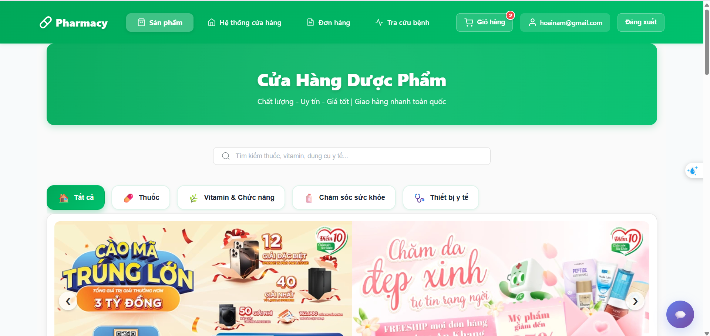
*Trang chủ - Danh mục sản phẩm với banner khuyến mãi*

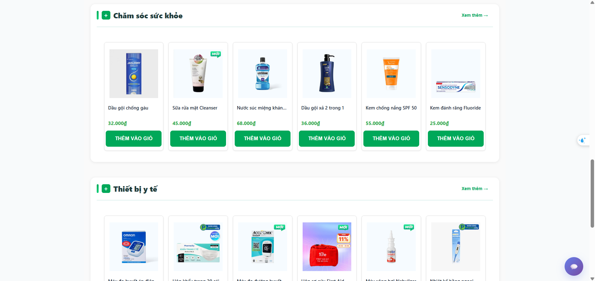
*Danh sách thuốc với tìm kiếm và filter theo danh mục*

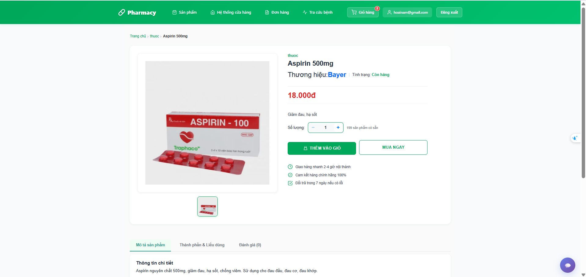
*Chi tiết sản phẩm với thông tin y tế, công dụng và đánh giá*

#### **Giỏ hàng & Thanh toán**
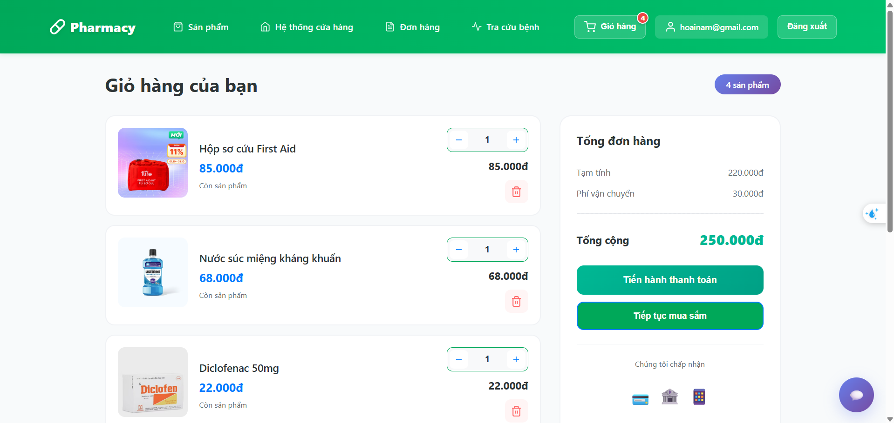
*Giỏ hàng - Quản lý sản phẩm trước khi thanh toán*

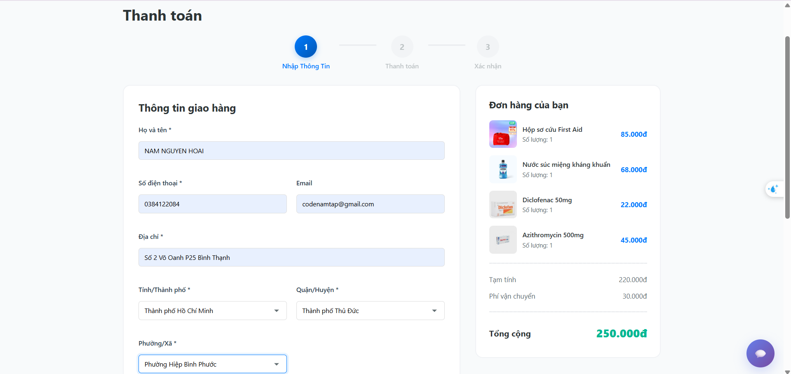
*Checkout - Nhập thông tin giao hàng*

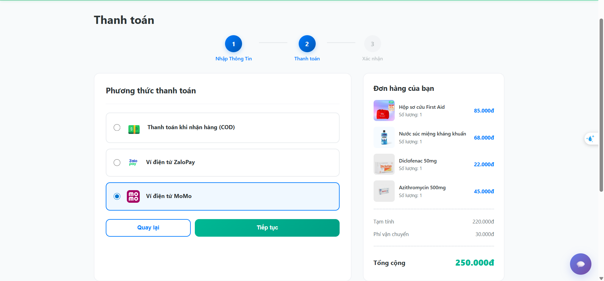
*Chọn phương thức thanh toán (COD/MoMo/ZaloPay)*

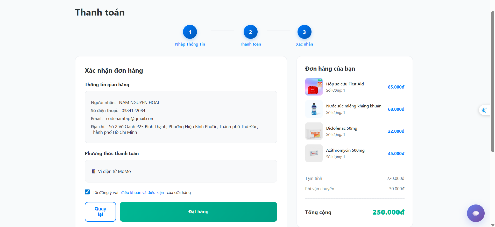
*Thanh toán qua MoMo - Quét QR hoặc nhập OTP*

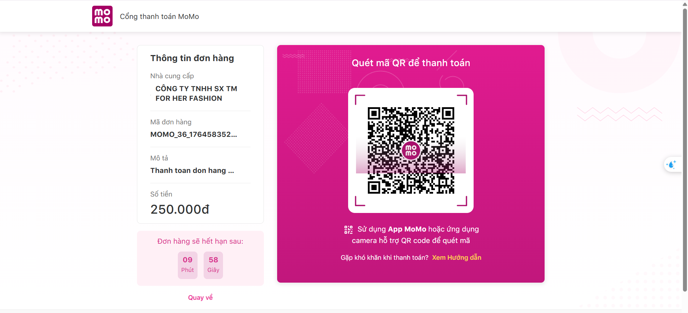
*Xác nhận đơn hàng thành công*

#### **Quản lý Đơn hàng**
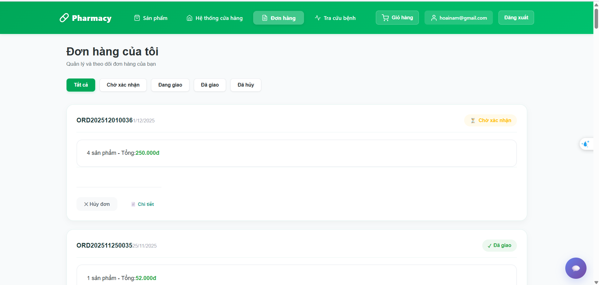
*Danh sách đơn hàng đã đặt*

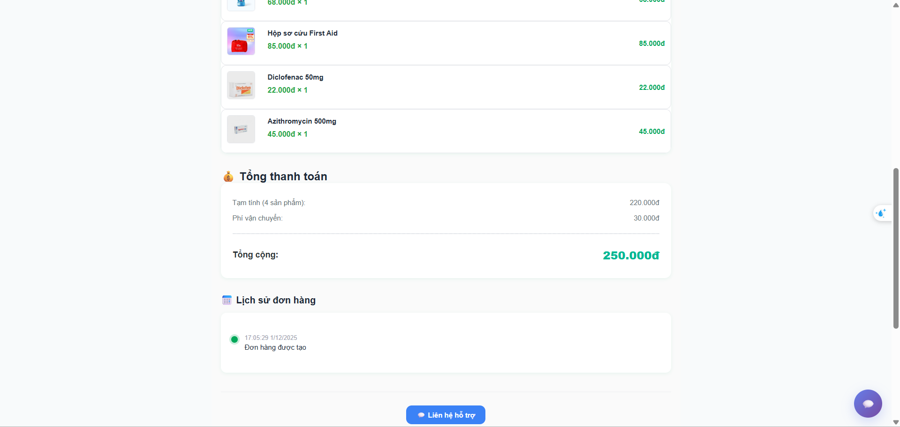
*Chi tiết đơn hàng và theo dõi trạng thái giao hàng*

#### **Tra cứu Bệnh**
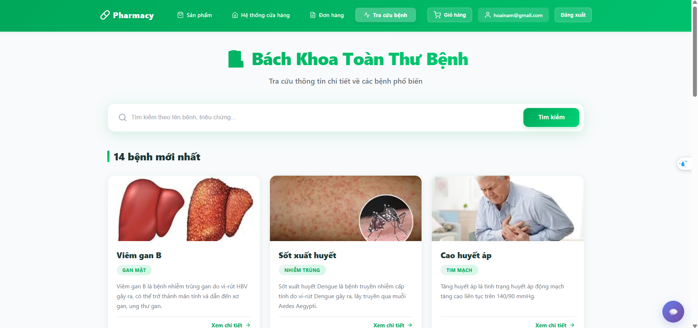
*Tra cứu bệnh theo triệu chứng*


*wikipedia cho từng bệnh*

#### **Chat Tư vấn**
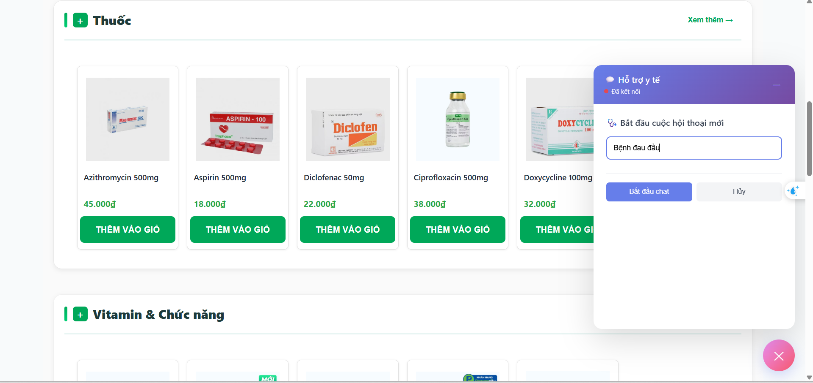
*Chat trực tiếp với dược sĩ để được tư vấn*

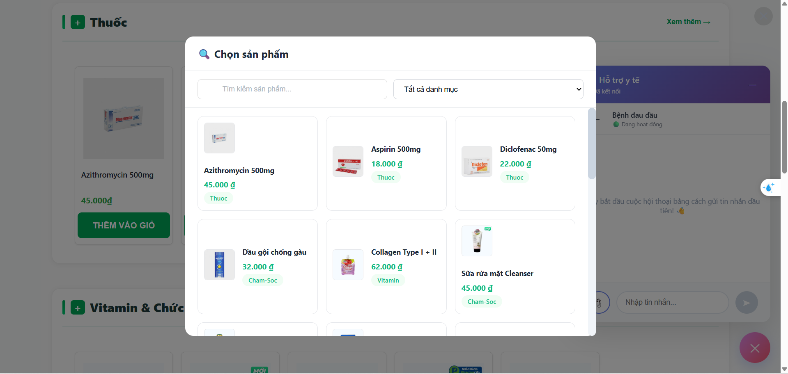
*Hỏi về bệnh và nhận tư vấn thuốc*

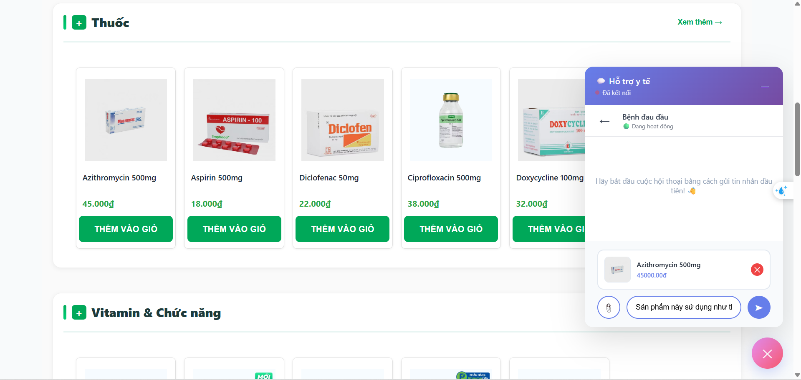
*Dược sĩ gợi ý sản phẩm phù hợp trong chat*

---

### **👨‍💼 Admin Dashboard**

#### **Thống kê & Tổng quan**
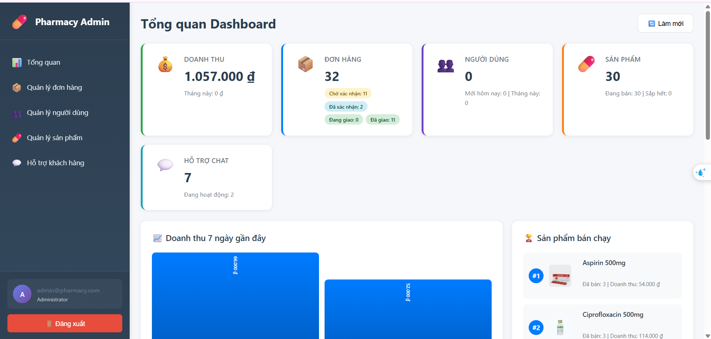
*Trang tổng quan với biểu đồ doanh thu, đơn hàng và top sản phẩm bán chạy*

#### **Quản lý Sản phẩm**
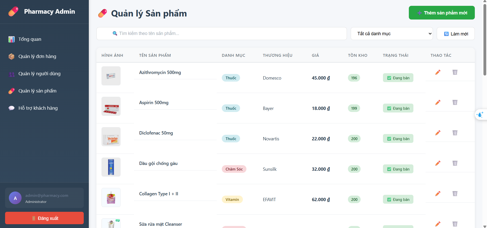
*Danh sách sản phẩm với chức năng thêm/sửa/xóa*

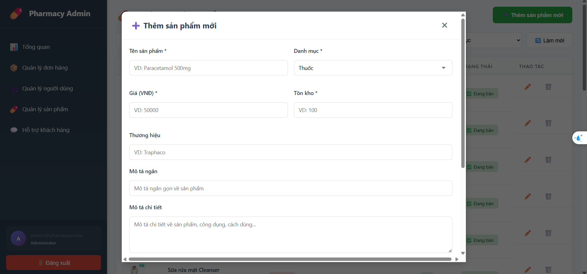
*Form thêm sản phẩm mới với upload ảnh lên Cloudinary*

#### **Quản lý Đơn hàng**
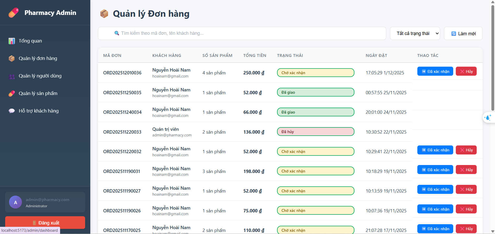
*Danh sách đơn hàng với cập nhật trạng thái realtime*

#### **Quản lý Người dùng**
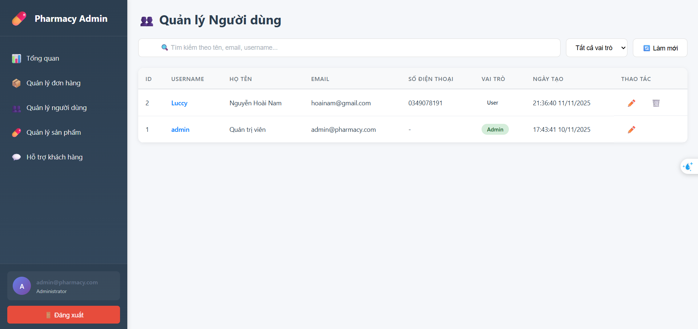
*Danh sách người dùng và phân quyền admin/customer*

#### **Quản lý Chat hỗ trợ**
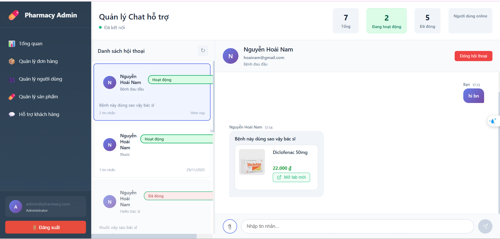
*Quản lý chat - Trả lời câu hỏi và gợi ý sản phẩm cho khách hàng realtime*

---


---

## **Cài đặt và chạy**

### **Yêu cầu**
- Node.js >= 18.x
- PostgreSQL >= 14.x
- npm >= 9.x

### **1. Clone project**
```bash
git clone https://github.com/hoainamcode22/Back_End_Pharmacy.git
cd Back_End_Pharmacy
```

### **2. Setup Database**
```bash
# Tạo database
createdb pharmacy_db

# Hoặc dùng psql
psql -U postgres
CREATE DATABASE pharmacy_db;

# Import schema (optional)
psql -U postgres -d pharmacy_db < Back_end/CSDL/pharmacy_db_v2.sql
```

### **3. Setup Backend**
```bash
cd Back_end

# Install
npm install

# Tạo .env
cat > .env << EOL
PORT=5001
DB_USER=postgres
DB_HOST=localhost
DB_NAME=pharmacy_db
DB_PASS=your_password
DB_PORT=5432
JWT_SECRET=your_secret_key_here
CLOUDINARY_CLOUD_NAME=your_cloud
CLOUDINARY_API_KEY=your_key
CLOUDINARY_API_SECRET=your_secret
EOL

# Start
npm start
```

Backend → `http://localhost:5001`

### **4. Setup Frontend**
```bash
# Terminal mới
cd Front_end

# Install
npm install

# Tạo .env
echo "VITE_API_BASE_URL=http://localhost:5001/api" > .env
echo "VITE_SOCKET_URL=http://localhost:5001" >> .env

# Start
npm run dev
```

Frontend → `http://localhost:5173`

---

## **Cấu trúc Project**

```
Back_End_Pharmacy/
│
├── Back_end/                 # Backend API
│   ├── CSDL/                # Database scripts
│   ├── public/images/       # Product images
│   ├── src/
│   │   ├── config/         # Cloudinary config
│   │   ├── controllers/    # Business logic
│   │   ├── middleware/     # Auth, upload
│   │   ├── routes/         # API routes
│   │   └── services/       # Chat, payment
│   ├── index.js            # Entry point
│   └── db_config.js        # DB connection
│
├── Front_end/               # Frontend React
│   ├── src/
│   │   ├── components/     # UI components
│   │   ├── context/        # Auth, Chat context
│   │   ├── pages/          # Pages
│   │   │   ├── admin/     # Admin pages
│   │   │   ├── auth/      # Login, Register
│   │   │   └── user/      # User pages
│   │   ├── api.jsx         # API calls
│   │   └── config.js       # API config
│   └── package.json
│
├── screenshots/             # Demo images
└── README.md               # This file
```

---

## **API Documentation**

**Base URL**: `http://localhost:5001/api`

**Swagger UI**: `http://localhost:5001/api-docs`

### **Endpoints chính**

#### Authentication
- `POST /auth/register` - Đăng ký tài khoản
- `POST /auth/login` - Đăng nhập

#### Products
- `GET /products` - Danh sách sản phẩm (public)
- `GET /products/:id` - Chi tiết sản phẩm
- `POST /products/admin` - Tạo sản phẩm (admin only)
- `PATCH /products/admin/:id` - Sửa sản phẩm
- `DELETE /products/admin/:id` - Xóa sản phẩm

#### Cart
- `GET /cart` - Lấy giỏ hàng
- `POST /cart/items` - Thêm vào giỏ
- `PATCH /cart/items/:id` - Cập nhật số lượng
- `DELETE /cart/items/:id` - Xóa sản phẩm

#### Orders
- `POST /orders/checkout` - Tạo đơn hàng
- `GET /orders` - Lịch sử đơn
- `GET /orders/:id` - Chi tiết đơn
- `PATCH /orders/:id/cancel` - Hủy đơn

#### Admin
- `GET /dashboard/statistics` - Thống kê tổng quan
- `GET /users/admin/all` - Danh sách users
- `PATCH /orders/admin/:id/status` - Cập nhật đơn hàng

Xem chi tiết: [API_DOCUMENTATION.md](./API_DOCUMENTATION.md)

---

## **Environment Variables**

### **Backend (.env)**
```env
# Server
PORT=5001

# Database
DB_USER=postgres
DB_HOST=localhost
DB_NAME=pharmacy_db
DB_PASS=your_password
DB_PORT=5432

# JWT
JWT_SECRET=your_secret_key

# Cloudinary (image upload)
CLOUDINARY_CLOUD_NAME=your_cloud_name
CLOUDINARY_API_KEY=your_api_key
CLOUDINARY_API_SECRET=your_api_secret

# MoMo Payment (Test)
MOMO_PARTNER_CODE=your_partner_code
MOMO_ACCESS_KEY=your_access_key
MOMO_SECRET_KEY=your_secret_key
MOMO_API_ENDPOINT=https://test-payment.momo.vn/v2/gateway/api/create
MOMO_REDIRECT_URL=http://localhost:5173/checkout/success
MOMO_IPN_URL=http://localhost:5001/api/payment/momo-ipn

# ZaloPay (Test)
ZALOPAY_APPID=your_app_id
ZALOPAY_KEY1=your_key1
ZALOPAY_KEY2=your_key2
ZALOPAY_ENDPOINT=https://sandbox.zalopay.com.vn/v001/tpe/createorder
ZALOPAY_REDIRECT_URL=http://localhost:5173/checkout/success
ZALOPAY_IPN_URL=http://localhost:5001/api/payment/zalopay-ipn
```

### **Frontend (.env)**
```env
VITE_API_BASE_URL=http://localhost:5001/api
VITE_SOCKET_URL=http://localhost:5001
```

---

## **Troubleshooting**

### Backend không start
```bash
# Check PostgreSQL
pg_isready

# Check port
netstat -ano | findstr :5001

# Verify .env
cat .env
```

### Frontend không gọi API
- ✅ Check backend đang chạy
- ✅ Verify `VITE_API_BASE_URL` trong `.env`
- ✅ Check browser console (F12) → Network tab

### Database connection error
- ✅ PostgreSQL đang chạy?
- ✅ Username/password đúng?
- ✅ Database `pharmacy_db` đã tạo?

### CORS error
- ✅ Backend CORS config có `http://localhost:5173`
- ✅ Restart cả backend và frontend

---

## **Testing**

### Test Backend
```bash
# Health check
curl http://localhost:5001

# Products API
curl http://localhost:5001/api/products
```

### Test Frontend
1. Mở `http://localhost:5173`
2. Đăng ký tài khoản
3. Đăng nhập
4. Test: Xem sản phẩm → Thêm giỏ → Checkout

---

## **Database Schema**

### Các bảng chính
- **Users** - Người dùng, admin
- **Products** - Sản phẩm thuốc
- **CartItems** - Giỏ hàng
- **Orders** - Đơn hàng
- **OrderItems** - Chi tiết đơn
- **Comments** - Đánh giá
- **Diseases** - Bệnh tật
- **ChatThreads** - Chat threads
- **ChatMessages** - Tin nhắn
- **Announcements** - Thông báo

### Relationships
```
Users (1:N) Orders
Users (1:N) CartItems  
Orders (1:N) OrderItems
Products (1:N) OrderItems
Products (1:N) Comments
```

---

## **Tác giả**

👤 **Hoài Nam**
- GitHub: [@hoainamcode22](https://github.com/hoainamcode22)
- Email: hoainamcode22@gmail.com

---

## **License**

Project phát triển cho mục đích học tập và demo kỹ năng.

---

## **Đóng góp**

Mọi đóng góp đều được chào đón!
1. Fork repo
2. Tạo branch (`git checkout -b feature/AmazingFeature`)
3. Commit (`git commit -m 'Add AmazingFeature'`)
4. Push (`git push origin feature/AmazingFeature`)
5. Tạo Pull Request

---

⭐ **Star repo này nếu thấy hữu ích!** ⭐
